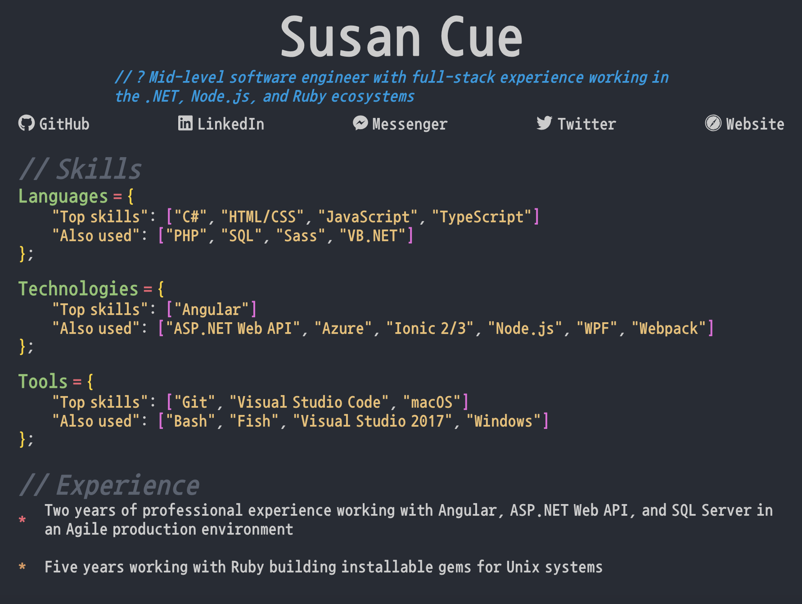

# Source Code Resume

A fun, developer-themed resume built to test out React and TypeScript. The data is loaded from JSON and then parsed by an engine to resemble source code syntax. Color scheme is adapted from [One Monokai Theme](https://marketplace.visualstudio.com/items?itemName=azemoh.one-monokai) for Visual Studio Code.

The `src/details.json` file contains all the data, which is loaded by the main App component and passed down to its children. Each component runs the data through `Utilities/SyntacticEngine.tsx` to create JSX elements formatted to look like source code. The page is also printable, though it's a little rough still.

## Sample

